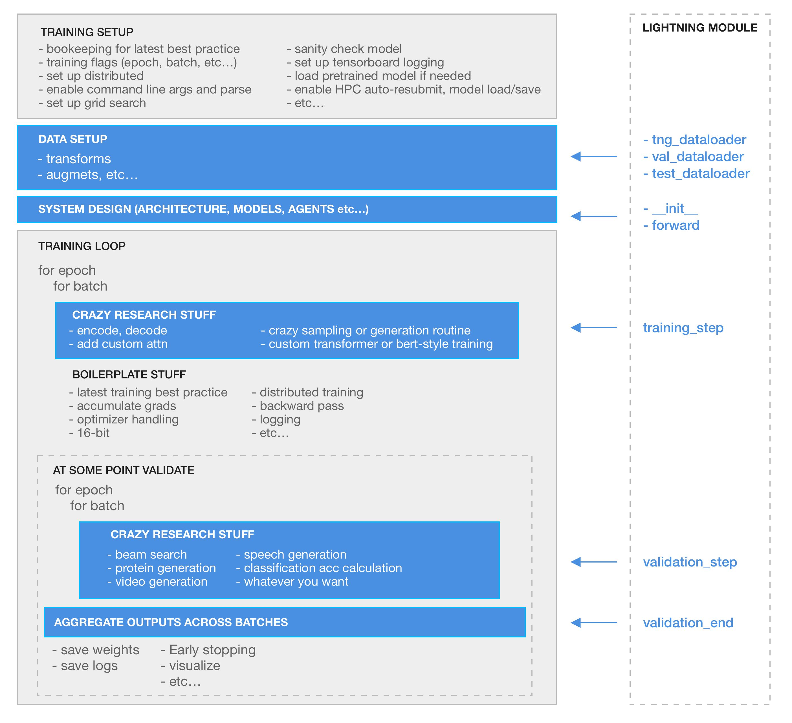
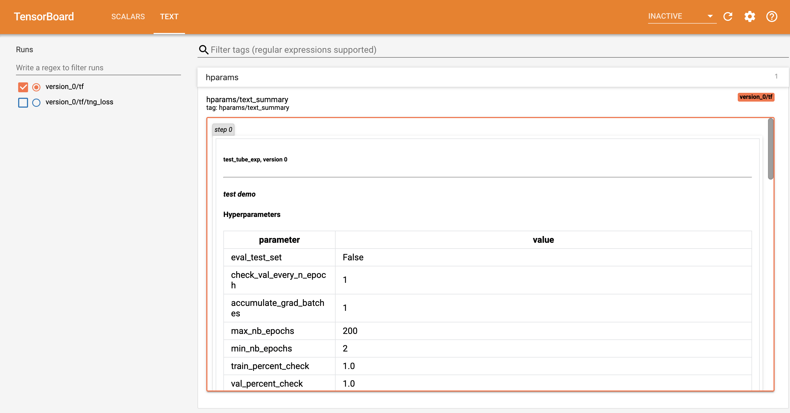

<div align="center">


# PyTorch Lightning

**The PyTorch Keras for ML researchers. More control. Less boilerplate.**


[](https://badge.fury.io/py/pytorch-lightning)
[](https://pepy.tech/project/pytorch-lightning)
[](https://travis-ci.org/williamFalcon/pytorch-lightning)
[](https://ci.appveyor.com/project/Borda/pytorch-lightning)
[](https://github.com/williamFalcon/pytorch-lightning/tree/master/tests#running-coverage)
[](https://www.codefactor.io/repository/github/borda/pytorch-lightning)
[](https://pytorch-lightning.readthedocs.io/en/latest)
[](https://github.com/williamFalcon/pytorch-lightning/blob/master/LICENSE)    
[](https://gitter.im/PyTorch-Lightning/community?utm_source=badge&utm_medium=badge&utm_campaign=pr-badge)    
<!-- 
removed until codecov badge isn't empy. likely a config error showing nothing on master.
[](https://codecov.io/gh/Borda/pytorch-lightning)
-->

</div>

Simple installation from PyPI
```bash
pip install pytorch-lightning  
```

## Docs   
**[View the docs here](https://williamfalcon.github.io/pytorch-lightning/)**

## What is it?  
Lightning is a very lightweight wrapper on PyTorch. This means you don't have to learn a new library. It defers core training and validation logic to you and automates the rest. It guarantees tested, correct, modern best practices for the automated parts.


## Why do I want to use lightning?
When starting a new project the last thing you want to do is recode a training loop, multi-cluster training, 16-bit precision, early-stopping, model loading/saving, when to validate, etc... You're likely to spend a long time ironing out all the bugs without even getting to the core of your research.

With lightning, you guarantee those parts of your code work so you can focus on the meat of the research: The data and the training/validation loop logic. 

Don't worry about training on multiple gpus or speeding up your code, lightning will do that for you!

---   
## README Table of Contents        
- [How do I use it](https://github.com/williamFalcon/pytorch-lightning#how-do-i-do-use-it)     
- [What lightning automates](https://github.com/williamFalcon/pytorch-lightning#what-does-lightning-control-for-me)    
- [Tensorboard integration](https://github.com/williamFalcon/pytorch-lightning#tensorboard)    
- [Lightning features](https://github.com/williamFalcon/pytorch-lightning#lightning-automates-all-of-the-following-each-is-also-configurable)    
- [Demos](https://github.com/williamFalcon/pytorch-lightning#demo)    
- [Tutorials](https://github.com/williamFalcon/pytorch-lightning#tutorials)
- [Contributing](https://github.com/williamFalcon/pytorch-lightning/blob/master/CONTRIBUTING.md)    
- [Bleeding edge install](https://github.com/williamFalcon/pytorch-lightning#bleeding-edge)   
- [Lightning Design Principles](https://github.com/williamFalcon/pytorch-lightning#lightning-design-principles)   
- [Asking for help](https://github.com/williamFalcon/pytorch-lightning#asking-for-help)
- [FAQ](https://github.com/williamFalcon/pytorch-lightning#faq)    

---   
## How do I do use it?   
The research code goes into a [LightningModule]((https://williamfalcon.github.io/pytorch-lightning/LightningModule/RequiredTrainerInterface/)) which you fit using a Trainer.    

Think of the LightningModule as a *system* such as seq-2-seq, GAN, etc... However, the LightningModule can ALSO just be a simple classifier such as the example below.     

To use lightning do 2 things:  
1. [Define a LightningModule](https://williamfalcon.github.io/pytorch-lightning/LightningModule/RequiredTrainerInterface/)         
```python
import os
import torch
from torch.nn import functional as F
from torch.utils.data import DataLoader
from torchvision.datasets import MNIST
import torchvision.transforms as transforms

import pytorch_lightning as pl

class CoolSystem(pl.LightningModule):

    def __init__(self):
        super(CoolSystem, self).__init__()
        # not the best model...
        self.l1 = torch.nn.Linear(28 * 28, 10)

    def forward(self, x):
        return torch.relu(self.l1(x.view(x.size(0), -1)))

    def training_step(self, batch, batch_nb):
        # REQUIRED
        x, y = batch
        y_hat = self.forward(x)
        return {'loss': F.cross_entropy(y_hat, y)}

    def validation_step(self, batch, batch_nb):
        # OPTIONAL
        x, y = batch
        y_hat = self.forward(x)
        return {'val_loss': F.cross_entropy(y_hat, y)}

    def validation_end(self, outputs):
        # OPTIONAL
        avg_loss = torch.stack([x['val_loss'] for x in outputs]).mean()
        return {'avg_val_loss': avg_loss}

    def configure_optimizers(self):
        # REQUIRED
        # can return multiple optimizers and learning_rate schedulers
        return torch.optim.Adam(self.parameters(), lr=0.02)

    @pl.data_loader
    def tng_dataloader(self):
        # REQUIRED
        return DataLoader(MNIST(os.getcwd(), train=True, download=True, transform=transforms.ToTensor()), batch_size=32)

    @pl.data_loader
    def val_dataloader(self):
        # OPTIONAL
        return DataLoader(MNIST(os.getcwd(), train=True, download=True, transform=transforms.ToTensor()), batch_size=32)

    @pl.data_loader
    def test_dataloader(self):
        # OPTIONAL
        return DataLoader(MNIST(os.getcwd(), train=True, download=True, transform=transforms.ToTensor()), batch_size=32)
```

2. Fit with a [trainer](https://williamfalcon.github.io/pytorch-lightning/Trainer/)    
```python
from pytorch_lightning import Trainer

model = CoolSystem()

# most basic trainer, uses good defaults
trainer = Trainer()    
trainer.fit(model)   
```     

Or with tensorboard logger and some options turned on such as multi-gpu, etc...    
```python   
from test_tube import Experiment    

# PyTorch summarywriter with a few bells and whistles    
exp = Experiment(save_dir=os.getcwd())

# train on cpu using only 10% of the data (for demo purposes)
# pass in experiment for automatic tensorboard logging.    
trainer = Trainer(experiment=exp, max_nb_epochs=1, train_percent_check=0.1)

# train on 4 gpus
# trainer = Trainer(experiment=exp, max_nb_epochs=1, gpus=[0, 1, 2, 3])

# train on 32 gpus across 4 nodes (make sure to submit appropriate SLURM job)
# trainer = Trainer(experiment=exp, max_nb_epochs=1, gpus=[0, 1, 2, 3, 4, 5, 6, 7], nb_gpu_nodes=4)

# train (1 epoch only here for demo)
trainer.fit(model)

# view tensorflow logs 
print('View tensorboard logs by running\ntensorboard --logdir %s' % os.getcwd())
print('and going to http://localhost:6006 on your browser')
```    

## What does lightning control for me?   

Everything in gray!    
You define the blue parts using the LightningModule interface:  



```{.python}
# what to do in the training loop
def training_step(self, data_batch, batch_nb):

# what to do in the validation loop
def validation_step(self, data_batch, batch_nb):

# how to aggregate validation_step outputs
def validation_end(self, outputs):

# and your dataloaders
def tng_dataloader():
def val_dataloader():
def test_dataloader():
```

**Could be as complex as seq-2-seq + attention**    

```python
# define what happens for training here
def training_step(self, data_batch, batch_nb):
    x, y = data_batch
    
    # define your own forward and loss calculation
    hidden_states = self.encoder(x)
     
    # even as complex as a seq-2-seq + attn model
    # (this is just a toy, non-working example to illustrate)
    start_token = '<SOS>'
    last_hidden = torch.zeros(...)
    loss = 0
    for step in range(max_seq_len):
        attn_context = self.attention_nn(hidden_states, start_token)
        pred = self.decoder(start_token, attn_context, last_hidden) 
        last_hidden = pred
        pred = self.predict_nn(pred)
        loss += self.loss(last_hidden, y[step])
        
    #toy example as well
    loss = loss / max_seq_len
    return {'loss': loss} 
```

**Or as basic as CNN image classification**      

```python
# define what happens for validation here
def validation_step(self, data_batch, batch_nb):    
    x, y = data_batch
    
    # or as basic as a CNN classification
    out = self.forward(x)
    loss = my_loss(out, y)
    return {'loss': loss} 
```

**And you also decide how to collate the output of all validation steps**    

```python
def validation_end(self, outputs):
    """
    Called at the end of validation to aggregate outputs
    :param outputs: list of individual outputs of each validation step
    :return:
    """
    val_loss_mean = 0
    val_acc_mean = 0
    for output in outputs:
        val_loss_mean += output['val_loss']
        val_acc_mean += output['val_acc']

    val_loss_mean /= len(outputs)
    val_acc_mean /= len(outputs)
    tqdm_dic = {'val_loss': val_loss_mean.item(), 'val_acc': val_acc_mean.item()}
    return tqdm_dic
```
   
## Tensorboard    
Lightning is fully integrated with tensorboard.   


Lightning also adds a text column with all the hyperparameters for this experiment.      



Simply note the path you set for the Experiment    
``` {.python}   
from test_tube import Experiment
from pytorch-lightning import  Trainer

exp = Experiment(save_dir='/some/path')
trainer = Trainer(experiment=exp)
...
```   

And run tensorboard from that dir   
```bash
tensorboard --logdir /some/path     
```    

## Lightning automates all of the following ([each is also configurable](https://williamfalcon.github.io/pytorch-lightning/Trainer/)):


###### Checkpointing    

- [Model saving](https://williamfalcon.github.io/pytorch-lightning/Trainer/Checkpointing/#model-saving)
- [Model loading](https://williamfalcon.github.io/pytorch-lightning/LightningModule/methods/#load-from-metrics) 
- [Restoring training session](https://williamfalcon.github.io/pytorch-lightning/Trainer/Checkpointing/#restoring-training-session)

###### Computing cluster (SLURM)    

- [Running grid search on a cluster](https://williamfalcon.github.io/pytorch-lightning/Trainer/SLURM%20Managed%20Cluster#running-grid-search-on-a-cluster) 
- [Walltime auto-resubmit](https://williamfalcon.github.io/pytorch-lightning/Trainer/SLURM%20Managed%20Cluster#walltime-auto-resubmit)   

###### Debugging  

- [Fast dev run](https://williamfalcon.github.io/pytorch-lightning/Trainer/debugging/#fast-dev-run)
- [Inspect gradient norms](https://williamfalcon.github.io/pytorch-lightning/Trainer/debugging/#inspect-gradient-norms)
- [Log GPU usage](https://williamfalcon.github.io/pytorch-lightning/Trainer/debugging/#Log-gpu-usage)
- [Make model overfit on subset of data](https://williamfalcon.github.io/pytorch-lightning/Trainer/debugging/#make-model-overfit-on-subset-of-data)
- [Print the parameter count by layer](https://williamfalcon.github.io/pytorch-lightning/Trainer/debugging/#print-the-parameter-count-by-layer)
- [Print which gradients are nan](https://williamfalcon.github.io/pytorch-lightning/Trainer/debugging/#print-which-gradients-are-nan)
- [Print input and output size of every module in system](https://williamfalcon.github.io/pytorch-lightning/LightningModule/properties/#example_input_array)


###### Distributed training    

- [16-bit mixed precision](https://williamfalcon.github.io/pytorch-lightning/Trainer/Distributed%20training/#16-bit-mixed-precision)
- [Multi-GPU](https://williamfalcon.github.io/pytorch-lightning/Trainer/Distributed%20training/#Multi-GPU)
- [Multi-node](https://williamfalcon.github.io/pytorch-lightning/Trainer/Distributed%20training/#Multi-node)
- [Single GPU](https://williamfalcon.github.io/pytorch-lightning/Trainer/Distributed%20training/#single-gpu)
- [Self-balancing architecture](https://williamfalcon.github.io/pytorch-lightning/Trainer/Distributed%20training/#self-balancing-architecture)


###### Experiment Logging   

- [Display metrics in progress bar](https://williamfalcon.github.io/pytorch-lightning/Trainer/Logging/#display-metrics-in-progress-bar)
- [Log metric row every k batches](https://williamfalcon.github.io/pytorch-lightning/Trainer/Logging/#log-metric-row-every-k-batches)
- [Process position](https://williamfalcon.github.io/pytorch-lightning/Trainer/Logging/#process-position)
- [Tensorboard support](https://williamfalcon.github.io/pytorch-lightning/Trainer/Logging/#tensorboard-support)
- [Save a snapshot of all hyperparameters](https://williamfalcon.github.io/pytorch-lightning/Trainer/Logging/#save-a-snapshot-of-all-hyperparameters) 
- [Snapshot code for a training run](https://williamfalcon.github.io/pytorch-lightning/Trainer/Logging/#snapshot-code-for-a-training-run) 
- [Write logs file to csv every k batches](https://williamfalcon.github.io/pytorch-lightning/Trainer/Logging/#write-logs-file-to-csv-every-k-batches)

###### Training loop    

- [Accumulate gradients](https://williamfalcon.github.io/pytorch-lightning/Trainer/Training%20Loop/#accumulated-gradients)
- [Force training for min or max epochs](https://williamfalcon.github.io/pytorch-lightning/Trainer/Training%20Loop/#force-training-for-min-or-max-epochs)
- [Force disable early stop](https://williamfalcon.github.io/pytorch-lightning/Trainer/Training%20Loop/#force-disable-early-stop)
- [Gradient Clipping](https://williamfalcon.github.io/pytorch-lightning/Trainer/Training%20Loop/#gradient-clipping)
- [Hooks](https://williamfalcon.github.io/pytorch-lightning/Trainer/hooks/)
- [Learning rate scheduling](https://williamfalcon.github.io/pytorch-lightning/LightningModule/RequiredTrainerInterface/#configure_optimizers)    
- [Use multiple optimizers (like GANs)](https://williamfalcon.github.io/pytorch-lightning/LightningModule/RequiredTrainerInterface/#configure_optimizers)
- [Set how much of the training set to check (1-100%)](https://williamfalcon.github.io/pytorch-lightning/Trainer/Training%20Loop/#set-how-much-of-the-training-set-to-check)
- [Step optimizers at arbitrary intervals](https://williamfalcon.github.io/pytorch-lightning/Trainer/hooks/#optimizer_step)

###### Validation loop    

- [Check validation every n epochs](https://williamfalcon.github.io/pytorch-lightning/Trainer/Validation%20loop/#check-validation-every-n-epochs)
- [Hooks](https://williamfalcon.github.io/pytorch-lightning/Trainer/hooks/)
- [Set how much of the validation set to check](https://williamfalcon.github.io/pytorch-lightning/Trainer/Validation%20loop/#set-how-much-of-the-validation-set-to-check)
- [Set how much of the test set to check](https://williamfalcon.github.io/pytorch-lightning/Trainer/Validation%20loop/#set-how-much-of-the-test-set-to-check)
- [Set validation check frequency within 1 training epoch](https://williamfalcon.github.io/pytorch-lightning/Trainer/Validation%20loop/#set-validation-check-frequency-within-1-training-epoch)
- [Set the number of validation sanity steps](https://williamfalcon.github.io/pytorch-lightning/Trainer/Validation%20loop/#set-the-number-of-validation-sanity-steps)


## Demo
```bash
# install lightning
pip install pytorch-lightning

# clone lightning for the demo
git clone https://github.com/williamFalcon/pytorch-lightning.git
cd pytorch-lightning
cd examples/new_project_templates/

# all of the following demos use the SAME model to show no modification needs to be made to your code

# train on cpu 
python single_cpu_template.py

# train on multiple-gpus 
python single_gpu_node_template.py --gpus "0,1"

# train on 32 gpus on a cluster (run on a SLURM managed cluster)
python multi_node_cluster_template.py --nb_gpu_nodes 4 --gpus '0,1,2,3,4,5,6,7'
```

## Tutorials   
- [Basic Lightning use](https://towardsdatascience.com/supercharge-your-ai-research-with-pytorch-lightning-337948a99eec)    
- [9 key speed features in Pytorch-Lightning](https://towardsdatascience.com/9-tips-for-training-lightning-fast-neural-networks-in-pytorch-8e63a502f565)    
- [SLURM, multi-node training with Lightning](https://towardsdatascience.com/trivial-multi-node-training-with-pytorch-lightning-ff75dfb809bd)     

---    
## Asking for help    
Welcome to the Lightning community! To chat with the rest of us visit our [gitter channel](https://gitter.im/PyTorch-Lightning/community?utm_source=share-link&utm_medium=link&utm_campaign=share-link)!

---   
## FAQ    
**How do I use Lightning for rapid research?**   
[Here's a walk-through](https://williamfalcon.github.io/pytorch-lightning/)  

**Why was Lightning created?**     
Lightning has 3 goals in mind:
1. Maximal flexibility while abstracting out the common boilerplate across research projects.   
2. Reproducibility. If all projects use the LightningModule template, it will be much much easier to understand what's going on and where to look! It will also mean every implementation follows a standard format.   
3. Democratizing PyTorch power user features. Distributed training? 16-bit? know you need them but don't want to take the time to implement? All good... these come built into Lightning.    

**How does Lightning compare with Ignite and fast.ai?**     
[Here's a thorough comparison](https://medium.com/@_willfalcon/pytorch-lightning-vs-pytorch-ignite-vs-fast-ai-61dc7480ad8a).    

**Is this another library I have to learn?**    
Nope! We use pure Pytorch everywhere and don't add unecessary abstractions!   

**Are there plans to support Python 2?**          
Nope.     

**Are there plans to support virtualenv?**    
Nope. Please use anaconda or miniconda.    

**Which PyTorch versions do you support?**    
##### PyTorch 1.1.0       
```bash    
# install pytorch 1.1.0 using the official instructions   

# install test-tube 0.6.7.6 which supports 1.1.0   
pip install test-tube==0.6.7.6   

# install latest Lightning version without upgrading deps    
pip install -U --no-deps pytorch-lightning
```     

##### PyTorch 1.2.0   
Install via pip as normal   

## Bleeding edge
If you can't wait for the next release, install the most up to date code with:  
```bash
pip install git+https://github.com/williamFalcon/pytorch-lightning.git@master --upgrade
```
